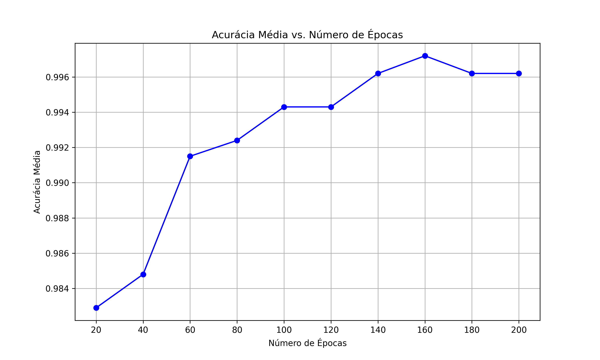
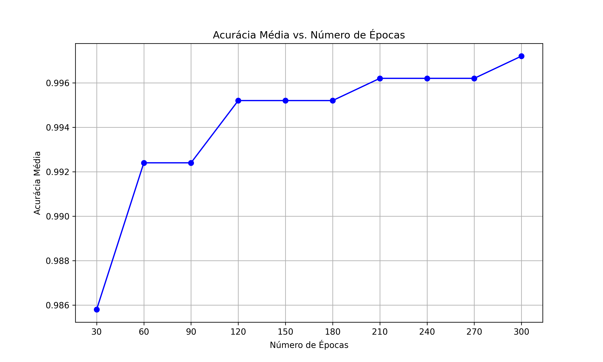
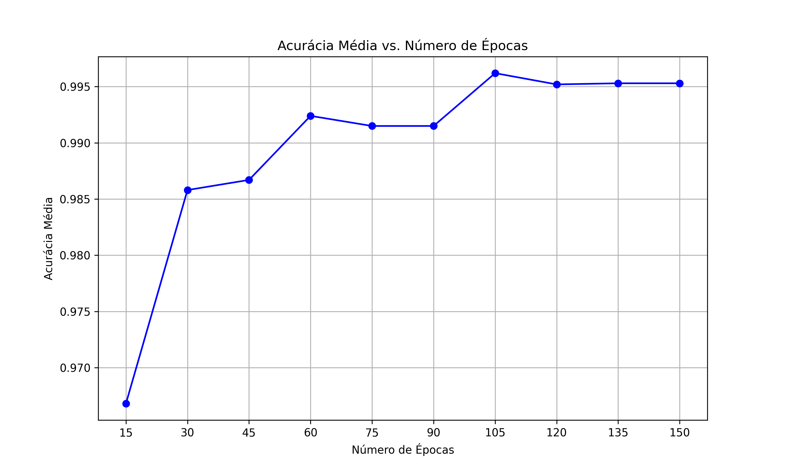
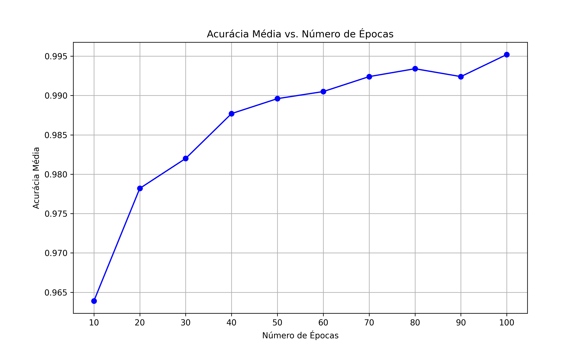
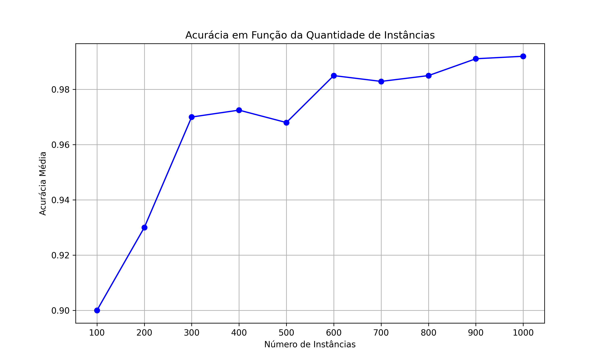
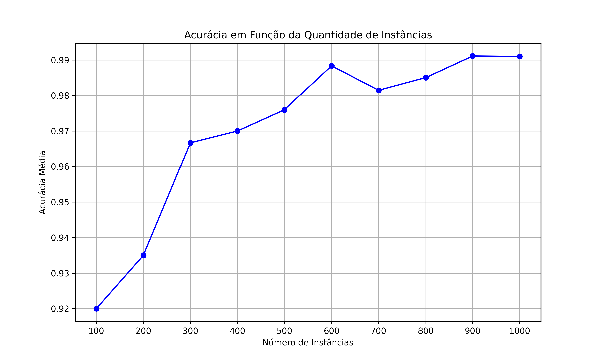
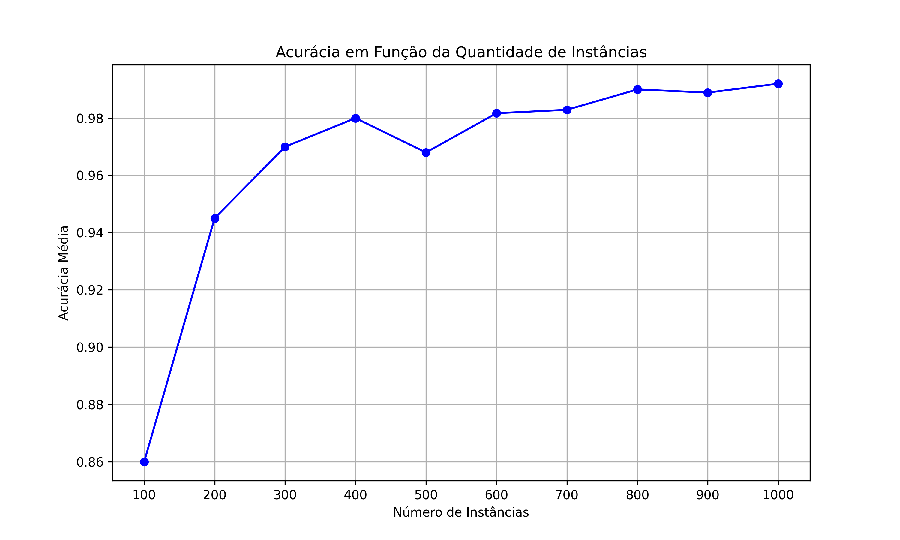

# Acurácia x Quantidade de Épocas

**Start**: 20  
**Step**: 20  
**Size**: 200  

| Épocas | Acurácia Média |
|--------|-----------------|
| 20     | 0.9829          |
| 40     | 0.9848          |
| 60     | 0.9915          |
| 80     | 0.9924          |
| 100    | 0.9943          |
| 120    | 0.9943          |
| 140    | 0.9962          |
| 160    | 0.9972          |
| 180    | 0.9962          |
| 200    | 0.9962          |

##

**Start**: 30  
**Step**: 30  
**Size**: 300  

| Épocas | Acurácia Média |
|--------|-----------------|
| 30     | 0.9858          |
| 60     | 0.9924          |
| 90     | 0.9924          |
| 120    | 0.9952          |
| 150    | 0.9952          |
| 180    | 0.9952          |
| 210    | 0.9962          |
| 240    | 0.9962          |
| 270    | 0.9962          |
| 300    | 0.9972          |

##

**Start**: 15  
**Step**: 15  
**Size**: 150  

| Épocas | Acurácia Média |
|--------|-----------------|
| 15     | 0.9668          |
| 30     | 0.9858          |
| 45     | 0.9867          |
| 60     | 0.9924          |
| 75     | 0.9915          |
| 90     | 0.9915          |
| 105    | 0.9962          |
| 120    | 0.9952          |
| 135    | 0.9953          |
| 150    | 0.9953          |

##

**Start**: 10  
**Step**: 10  
**Size**: 100  

| Épocas | Acurácia Média |
|--------|-----------------|
| 10     | 0.9639          |
| 20     | 0.9782          |
| 30     | 0.9820          |
| 40     | 0.9877          |
| 50     | 0.9896          |
| 60     | 0.9905          |
| 70     | 0.9924          |
| 80     | 0.9934          |
| 90     | 0.9924          |
| 100    | 0.9952          |

# Acurácia x Quantidade de Instâncias (90 épocas)

**Start**: 100  
**Step**: 100  
**Size**: 1000  

| Instâncias | Acurácia Média  |
|------------|-----------------|
| 100        | 0.9000          |
| 200        | 0.9300          |
| 300        | 0.9700          |
| 400        | 0.9725          |
| 500        | 0.9680          |
| 600        | 0.9850          |
| 700        | 0.9829          |
| 800        | 0.9850          |
| 900        | 0.9911          |
| 1000       | 0.9920          |

**Start**: 100  
**Step**: 100  
**Size**: 1000  

| Instâncias | Acurácia Média  |
|------------|-----------------|
| 100        | 0.9200          |
| 200        | 0.9350          |
| 300        | 0.9667          |
| 400        | 0.9700          |
| 500        | 0.9760          |
| 600        | 0.9883          |
| 700        | 0.9814          |
| 800        | 0.9850          |
| 900        | 0.9911          |
| 1000       | 0.9910          |

**Start**: 100  
**Step**: 100  
**Size**: 1000  

| Instâncias | Acurácia Média  |
|------------|-----------------|
| 100        | 0.8600          |
| 200        | 0.9450          |
| 300        | 0.9700          |
| 400        | 0.9800          |
| 500        | 0.9680          |
| 600        | 0.9817          |
| 700        | 0.9829          |
| 800        | 0.9900          |
| 900        | 0.9889          |
| 1000       | 0.9920          |